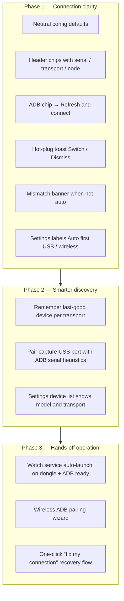

# Seamless UX Strategy

Android TV Connect pairs **HDMI capture** (video/audio from a MacroSilicon dongle) with **ADB** (remote control). Those paths are independent: capture does not imply which ADB device is targeted, and ADB does not require capture. This document describes a phased plan to make connection setup feel automatic while keeping explicit control when needed.

## Principles

- **Neutral defaults** — new installs use auto-discovery (`wired_serial: ""`, `wireless_host: ""`) instead of developer-specific serials.
- **Capture ≠ ADB** — UI and settings always treat video and control as separate concerns.
- **Refresh on demand** — the header ADB chip re-scans devices, invalidates capture cache, and reconnects.
- **Gentle guidance** — banners and toasts surface ambiguity (multiple devices, hot-plug) without blocking normal use.

## Phased rollout

### Phase 1 (v1.1.3) — Connection clarity

| Area | Behavior |
|------|----------|
| Defaults | Empty serial/host = auto; legacy dev serials migrate on load |
| Header | Capture chip shows V4L2 node; ADB chip shows serial + USB/Wi‑Fi |
| ADB chip click | Invalidate capture cache, `adb devices`, reconnect, toast |
| Hot-plug | Configured USB serial vanished + exactly one new USB → Switch toast |
| Mismatch | Banner when capture present, multiple ADB targets, wired serial not auto |
| Settings | “Auto (first USB)”, “Auto (first wireless)”; capture/ADB note |

### Phase 2 — Smarter discovery

- Persist last successful wired serial and wireless host when auto mode connects.
- Correlate USB topology (capture dongle vs debug cable) to suggest the right ADB target.
- Richer device rows in Settings (product name, transport, last seen).

### Phase 3 — Hands-off operation

- Extend the systemd user watcher to launch the app when capture + ADB are both ready.
- Guided wireless debugging setup (pairing code, port, firewall hints).
- Single “Recover connection” action that retries capture, ADB, and scrcpy in order.

## User flows

### First launch (auto mode)

1. User plugs capture dongle and enables USB debugging on the TV stick.
2. App starts with empty ADB settings → first USB device wins.
3. Header chips show live capture node and connected serial.
4. Click **ADB** any time to force a full refresh.

### Multiple Android devices

1. User sets a specific wired serial in Settings (not auto).
2. If capture is active and `adb devices` lists more than one target, a dismissible banner warns to confirm the match.
3. Hot-plug: if the configured serial disappears and exactly one new USB device appears, a toast offers **Switch** or dismiss.

## Configuration reference

| Key | Empty / Auto meaning |
|-----|----------------------|
| `adb.wired_serial` | First USB ADB device in `device` state |
| `adb.wireless_host` | First wireless entry from `adb devices`, or network scan on connect |
| `capture.video_device` | Auto-resolve MacroSilicon V4L2 node |

Legacy installs that still have the old dev defaults (`FUSA2541006925`, `192.168.1.157`) are migrated to auto on load; custom values are never overwritten.

## Related docs

- [UPDATES.md](UPDATES.md) — release and in-app update flow
- [SCRCPY.md](SCRCPY.md) — optional screen mirror window
