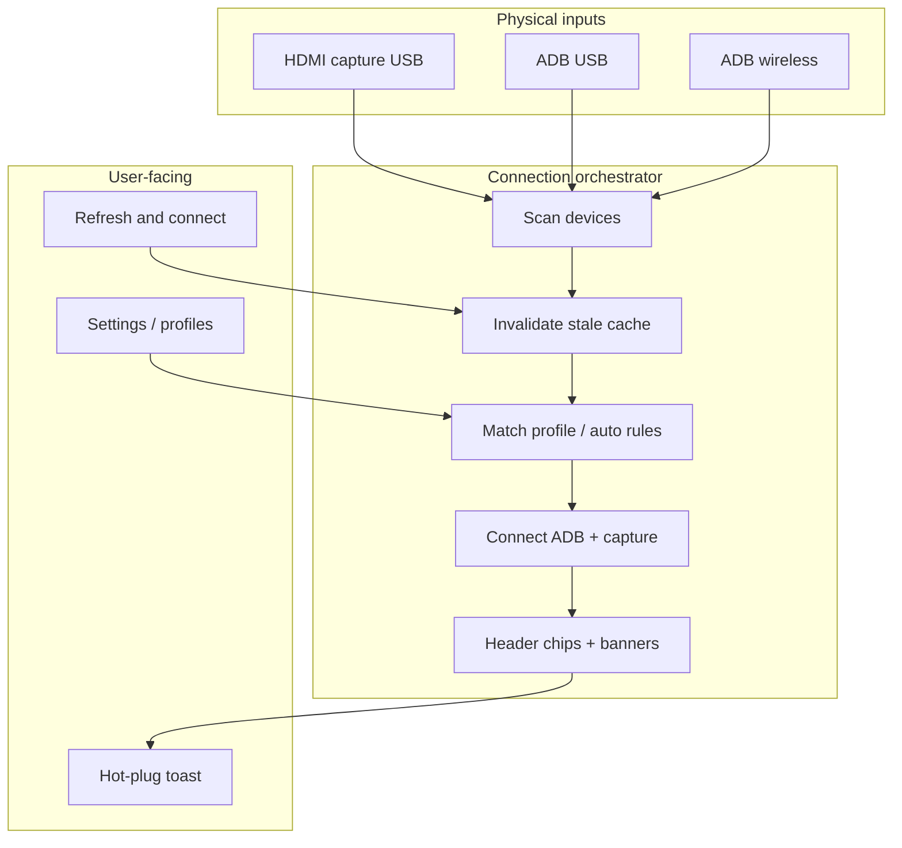

# Seamless connection UX

Android TV Connect pairs **HDMI capture** (what you see) with **ADB** (how you control the device). Those two paths are independent today — swapping capture cards or Android sticks should never leave you fighting stale defaults.

This document is the phased plan for making plug-in, swap, and reconnect feel obvious instead of fiddly.

---

## Vision

One **connection orchestrator** keeps capture and ADB in sync with what is actually plugged in, surfaces clear status in the header, and nudges you only when something looks wrong — not on every launch.

---

## Phase 1 — Quick wins (shipped in 1.1.3)

**Goal:** Works out of the box on any desk — no baked-in serials or IPs.

| Area | What changed |
|------|----------------|
| **Neutral defaults** | New installs use auto ADB (`wired_serial` / `wireless_host` empty). Old dev-host defaults migrate to auto on load without touching custom values. |
| **Status chips** | Header shows active capture node and ADB target (serial/IP + USB vs Wi‑Fi). Tooltips spell out transport. |
| **Refresh & connect** | One header action: flush capture cache, re-scan ADB, reconnect with your prefer-wired setting. Optional success toast. |
| **Mismatch banner** | When capture USB is present and multiple ADB devices are visible, a simple banner asks you to confirm the right target. |
| **Hot-plug lite** | On window focus and every 30s: if your watched serial vanishes and exactly one new USB device appears, a non-blocking toast offers **Switch** or **Dismiss** (dismiss lasts the session). |
| **Settings copy** | Clearer auto labels; capture section notes that video and ADB are independent (this doc linked). |

**Not in Phase 1:** saved device profiles, pairing capture card + stick as one unit, embedded mirror, first-run wizard.

---

## Phase 2 — Device profiles

**Goal:** One named profile per desk setup (e.g. “living-room stick”, “bench FHD card”).

- **Profile fields:** label, capture `video_device` / USB id, ADB wired serial, wireless host/port, prefer-wired flag.
- **Profile picker** in header or settings; last-used profile on launch.
- **Optional pairing:** “This capture card usually goes with this ADB serial” — suggest or auto-select when both appear.
- **Import/export** profiles as JSON for backup when swapping hardware.

---

## Phase 3 — Polish and invisible maintenance

**Goal:** Feels like a single appliance, not a dev tool.

- **Embedded mirror** — scrcpy (or successor) in-pane instead of a separate window where practical.
- **First-run wizard** — detect capture + ADB, walk through auto vs manual, test remote control.
- **Updates banner** — unobtrusive “update available” in chrome; install via existing launcher without modal interruption.

---

## Tips for swapping hardware

1. Click **Refresh & connect** after plugging in a new stick or capture card.
2. If the mismatch banner appears, open **Settings → ADB Connection** and pick the correct USB device.
3. Capture and ADB are **independent** — HDMI can show one stick while ADB controls another until you align them in settings.
4. Use **Auto (first USB device)** when only one stick is on the bench; pin a serial when you routinely have several connected.

---

## Related docs

- [SCRCPY.md](SCRCPY.md) — screen mirror options
- [UPDATES.md](UPDATES.md) — launcher update flow
