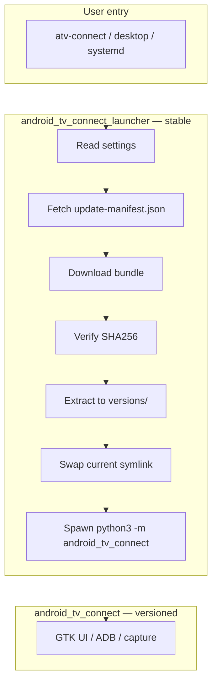

# In-app updates (isolated launcher)

Android TV Connect uses a **two-layer** install so updates keep working even when the main GTK app is broken.

## Architecture



| Layer | Package | Location | Changes |
|-------|---------|----------|---------|
| Launcher | `android_tv_connect_launcher` | `~/.local/share/android-tv-connect/launcher/` | Rarely (updater bugs only) |
| App | `android_tv_connect` | `~/.local/share/android-tv-connect/versions/<version>/` | Every release |

The launcher **never imports** the main app before checking for updates.

## Install layout

```
~/.local/share/android-tv-connect/
  launcher/                 # tiny updater package
  versions/
    1.0.0/
    1.1.0/
  current -> versions/1.1.0
  installed.json
```

## Update manifest

Published as a GitHub release asset (`update-manifest.json`):

```json
{
  "version": "1.1.0",
  "versionCode": 2,
  "bundleUrl": "https://github.com/thothassistantai-web/android-tv-connect/releases/download/v1.1.0/android-tv-connect-1.1.0.tar.gz",
  "sha256": "...",
  "mandatory": false,
  "releaseNotes": "..."
}
```

| Field | Required | Notes |
|-------|----------|-------|
| `version` | Yes | Semantic version shown in UI |
| `versionCode` | Yes | Integer; must increase to offer an update |
| `bundleUrl` | Yes | HTTPS link to `.tar.gz` (or `.zip`) |
| `sha256` | Recommended | Verified before extract |
| `releaseNotes` | No | Shown in Settings → Updates |
| `mandatory` | No | Force install on next launch |

### Default manifest URL

When Settings → **Manifest URL override** is empty, the launcher uses:

`https://api.github.com/repos/thothassistantai-web/android-tv-connect/releases/latest`

The launcher prefers a release asset named `update-manifest.json`. If missing, it falls back to the first `.tar.gz` / `.zip` asset plus `versionCode` from the release body (`versionCode: 2`) or tag (`v1.1.0+2`).

## User entry command

```bash
atv-connect
```

Equivalent:

```bash
python3 -m android_tv_connect_launcher
```

Development checkout:

```bash
PYTHONPATH=. python3 -m android_tv_connect_launcher
```

## Settings (main app)

| Setting | Default | Description |
|---------|---------|-------------|
| Check on launch | On | Launcher checks GitHub before spawning the app |
| Manifest URL override | Empty | Custom manifest or GitHub API URL |
| Check for updates now | — | Runs launcher `--check-updates --json` |

## Maintainer release flow

1. Bump `VERSION` and `VERSION_CODE`.
2. Run `./scripts/build-release.sh`.
3. Create GitHub release `v<VERSION>` and upload:
   - `release/android-tv-connect-<VERSION>.tar.gz`
   - `release/update-manifest.json`
4. Users get the update on next `atv-connect` launch (if auto-check is on).

## Recovery

If a bad app release ships, the launcher still runs:

```bash
atv-connect --no-update-check    # skip check, try current bundle
atv-connect --apply-updates      # force install latest from GitHub
```

Re-install from source:

```bash
./scripts/install-local.sh
```

## Security

- Only install bundles from sources you trust.
- Manifest `sha256` is verified when present.
- Do not commit GitHub tokens or private manifest URLs with secrets.
