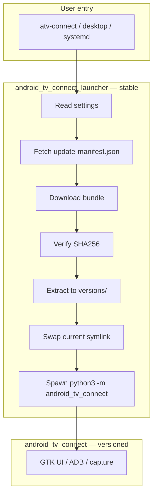

# In-app updates (isolated launcher)

Android TV Connect uses a **two-layer** install so updates keep working even when the main GTK app is broken.

## Architecture



| Layer | Package | Location | Changes |
|-------|---------|----------|---------|
| Launcher | `android_tv_connect_launcher` | `<app_home>/launcher/` or checkout root in dev mode | Rarely (updater bugs only) |
| App | `android_tv_connect` | `<app_home>/versions/<version>/` or checkout root in dev mode | Every release |

The launcher **never imports** the main app before checking for updates.

## App home (`app_home`)

By default, installs live under `~/.local/share/android-tv-connect/`. To keep everything in a source checkout (for example `/home/nova/Programs/Android TV Connect/`), set **`app_home`** in `~/.config/android-tv-connect/config.json`:

```json
{
  "app_home": "/home/nova/Programs/Android TV Connect"
}
```

Or export **`ATV_CONNECT_HOME`** (overrides config for that shell/session):

```bash
export ATV_CONNECT_HOME="/home/nova/Programs/Android TV Connect"
```

Then re-run `./scripts/install-local.sh`. When `app_home` equals your git checkout:

- **`current`** symlinks to the checkout root (no duplicate copy of `android_tv_connect/`)
- **`atv-connect`** runs the launcher and app from that tree
- **Updates** still extract to `<app_home>/versions/<version>/` and swap `current` (same safe rollback model)

Priority: `ATV_CONNECT_HOME` env → `app_home` in config → `~/.local/share/android-tv-connect`.

## Install layout

Default (`~/.local/share/android-tv-connect/`):

```
~/.local/share/android-tv-connect/
  launcher/                 # tiny updater package
  versions/
    1.0.0/
    1.1.0/
  current -> versions/1.1.0
  installed.json
```

Dev checkout (`app_home` = source tree):

```
/home/you/Programs/Android TV Connect/
  android_tv_connect/       # live source — current points here
  android_tv_connect_launcher/
  versions/                 # downloaded updates land here
  current -> .              # symlink to checkout root
  installed.json
```

## Update manifest

Published as a GitHub release asset (`update-manifest.json`):

```json
{
  "version": "1.1.0",
  "versionCode": 2,
  "bundleUrl": "https://github.com/thothassistantai-web/android-tv-connect/releases/download/v1.1.0/android-tv-connect-1.1.0.tar.gz",
  "sha256": "...",
  "mandatory": false,
  "releaseNotes": "..."
}
```

| Field | Required | Notes |
|-------|----------|-------|
| `version` | Yes | Semantic version shown in UI |
| `versionCode` | Yes | Integer; must increase to offer an update |
| `bundleUrl` | Yes | HTTPS link to `.tar.gz` (or `.zip`) |
| `sha256` | Recommended | Verified before extract |
| `releaseNotes` | No | Shown in Settings → Updates |
| `mandatory` | No | Force install on next launch |

### Default manifest URL

When Settings → **Manifest URL override** is empty, the launcher uses:

`https://api.github.com/repos/thothassistantai-web/android-tv-connect/releases/latest`

The launcher prefers a release asset named `update-manifest.json`. If missing, it falls back to the first `.tar.gz` / `.zip` asset plus `versionCode` from the release body (`versionCode: 2`) or tag (`v1.1.0+2`).

If the GitHub API request fails (for example HTTP 403 from unauthenticated rate limiting), the launcher automatically retries using the static release asset URL:

`https://github.com/thothassistantai-web/android-tv-connect/releases/latest/download/update-manifest.json`

That URL does not consume GitHub REST API quota and works for public releases.

### GitHub API authentication (optional)

For private repos or higher rate limits, set a personal access token (never commit or log it):

```json
{
  "updates": {
    "github_token": "ghp_..."
  }
}
```

Or export `GITHUB_TOKEN` in the environment (takes effect when `github_token` is not set in config). The launcher sends `User-Agent: AndroidTVConnectLauncher/<version>` on every request and adds `Authorization: Bearer …` when a token is configured.

Update check failures are **non-fatal** — the launcher logs a warning and still starts the installed app.

## User entry command

```bash
atv-connect
```

Equivalent:

```bash
python3 -m android_tv_connect_launcher
```

Development checkout:

```bash
PYTHONPATH=. python3 -m android_tv_connect_launcher
```

### Dev install (`app_home`)

Point installs at your checkout so `atv-connect` runs edited source directly:

1. Add to `~/.config/android-tv-connect/config.json`:
   ```json
   { "app_home": "/path/to/Android TV Connect" }
   ```
2. Run `./scripts/install-local.sh` from that checkout.

Edits under `android_tv_connect/` take effect on the next launch. Re-run `install-local.sh` after pulling launcher changes. See [docs/UPDATES.md](docs/UPDATES.md) for update behavior.

## Settings (main app)

| Setting | Default | Description |
|---------|---------|-------------|
| Check on launch | On | Launcher checks GitHub before spawning the app |
| Manifest URL override | Empty | Custom manifest or GitHub API URL |
| Check for updates now | — | Runs launcher `--check-updates --json` |

## Maintainer release flow

1. Bump `VERSION` and `VERSION_CODE`.
2. Run `./scripts/build-release.sh`.
3. Create GitHub release `v<VERSION>` and upload:
   - `release/android-tv-connect-<VERSION>.tar.gz`
   - `release/update-manifest.json`
4. Users get the update on next `atv-connect` launch (if auto-check is on).

## Recovery

If a bad app release ships, the launcher still runs:

```bash
atv-connect --no-update-check    # skip check, try current bundle
atv-connect --apply-updates      # force install latest from GitHub
```

Re-install from source:

```bash
./scripts/install-local.sh
```

## Security

- Only install bundles from sources you trust.
- Manifest `sha256` is verified when present.
- Do not commit GitHub tokens or private manifest URLs with secrets.
- Rotate any token that was pasted into chat or committed by mistake.
